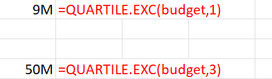
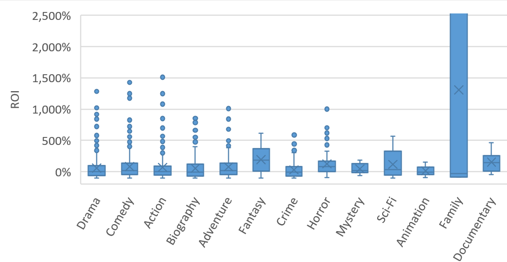
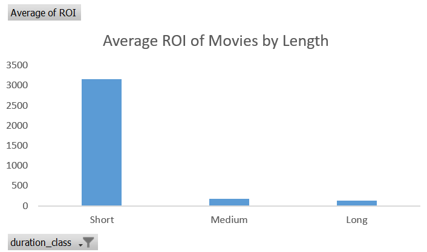
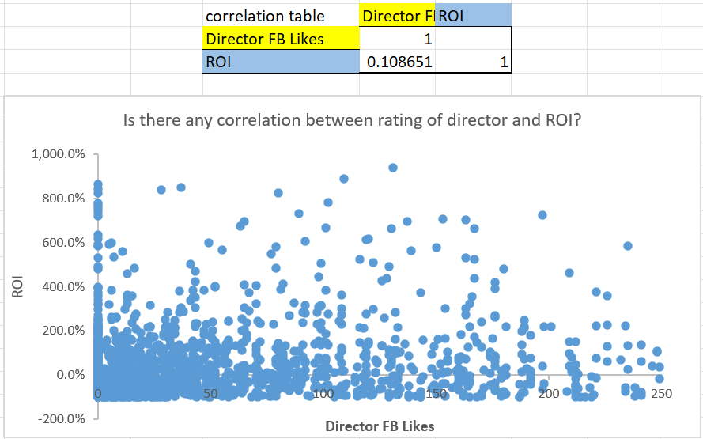

# IMDB Movie Data Analysis
### Supporting Strategic Investment Decisions

---

## 📋 Project Overview

This project focuses on a comprehensive analysis of the IMDB movie database to provide data-driven insights for potential investors in the film industry. By integrating quantitative performance metrics with qualitative production data, the analysis aims to identify the key factors that contribute to a film's financial and critical success.

> 🎓 This project was developed as part of the **Data Analyst Program** at the **Hebrew University of Jerusalem (HUJI)**, under the guidance of **Dr. Jonathan Zouari**.

---

## 🎯 Objective

The primary goal is to resolve the **"Investor's Dilemma"** by analyzing historical data to minimize risk and maximize **Returns on Investment (ROI)**. The project explores correlations between budgets, social media engagement (Facebook likes), genres, and IMDb scores to predict whether a movie will be a **"Hit"** or a **"Flop."**

---

## 🛠️ Investor Recommendation Process

To build an investor recommendation tailored to a risk-averse profile, I first identified the "mid-range" budget segment relevant to the request. I then analyzed ROI by movie genres using box plots to highlight options that balance profitability with moderate risk. After selecting a suitable genre, I determined the ideal movie length and explored whether director popularity (e.g., Facebook Likes) is linked to movie success. This process led to an integrated recommendation with suggested budget range, genre, ideal duration, and insights for team selection to maximize ROI while minimizing risk.

---

## 📊 Dataset & Preparation

The analysis is based on a multi-source dataset containing information on thousands of films, including:

| Type | Variables |
|---|---|
| **Quantitative** | Budgets, Gross Revenues, IMDb Scores, Social Media Metrics |
| **Qualitative** | Genres, Languages, Directors, Content Ratings |

### 🔧 Key Data Engineering Steps

- **Data Integration** — Merging multiple datasets using unique identifiers.
- **Feature Engineering:**
  - Calculated `Profit` and `Success` metrics.
  - Classified movies by Duration (`Short` / `Medium` / `Long`).
  - Created binary indicators for language and regional analysis (e.g., `is_english`).

---

## 🔍 Analysis Directions

The project addresses several business-critical questions:

| # | Theme | Question |
|---|---|---|
| 1 | 💰 **Financial Viability** | What is the relationship between a movie's budget and its gross revenue? |
| 2 | 📱 **Social Influence** | How do director and cast Facebook likes impact the final IMDb score? |
| 3 | 🎬 **Content Strategy** | Which genres and movie lengths (Duration Class) yield the highest success rates? |
| 4 | 📈 **Market Trends** | How has movie performance evolved over the years? |

| Variable Name | Data Type | Description | Source / Calculation |
|---|---|---|---|
| Title | Categorical | The unique name of the movie. | Original (Sheet 1 & 2) |
| Lead Actor | Categorical | The name of the main actor in the film. | Original (Sheet 1) |
| Director Name | Categorical | The name of the film's director. | Original (Sheet 1) |
| Lead Actor FB Likes | Numerical | Number of Facebook likes for the lead actor. | Original (Sheet 1) |
| Cast FB Likes | Numerical | Total Facebook likes for the entire cast. | Original (Sheet 1) |
| Director FB Likes | Numerical | Number of Facebook likes for the director. | Original (Sheet 1) |
| Movie FB Likes | Numerical | Total Facebook likes for the movie's official page. | Original (Sheet 1) |
| IMDb Score | Numerical | The average user rating on IMDb (scale 1-10). | Original (Sheet 1) |
| Total Reviews | Numerical | Number of critical reviews submitted for the film. | Original (Sheet 1) |
| Duration (min) | Numerical | The total length of the movie in minutes. | Original (Sheet 1) |
| Gross Revenue | Numerical | Total box office earnings in USD. | Original (Sheet 1) |
| Budget | Numerical | Total production cost in USD. | Original (Sheet 1) |
| Release Date | Numerical (Date) | The full date the movie was released. | Original (Sheet 2) |
| Color/B&W | Categorical | Whether the film is in color or black and white. | Original (Sheet 2) |
| Genre | Categorical | The primary genre classification of the movie. | Original (Sheet 2) |
| Language | Categorical | The primary language spoken in the film. | Original (Sheet 2) |
| Country | Categorical | The country where the film was produced. | Original (Sheet 2) |
| Rating | Categorical | Content rating (e.g., G, PG, PG-13, R). | Original (Sheet 2) |
| duration_class | Categorical | Classification by length (Short, Medium, Long). | Based on `=IFS(J2<90,"Short",J2<=120,"Medium",J2>120,"Long")` |
| Profit | Numerical | Net earnings (Gross Revenue minus Budget). | `` `Gross - Budget` `` |
| is_english | Categorical | Binary indicator (Yes/No) if the language is English. | `=IF(P2="english", 1,0)` |

### 🟢 Step 1: Identifying the Investor's Launch Range (Mid-Budget Segment)

The first analytical step is to determine the "launch range" for our investor, focusing on the mid-budget segment. To define this, I considered the span between the 25th and 75th percentiles of movie budgets in the dataset. This range effectively excludes extreme outliers at both ends and zeroes in on the typical investment window for most mid-budget productions.

Below is the relevant percentile visualization:

---
### 🟢 Step 2: Narrowing Down with Genre — Risk-Aware Investor Focus

To further refine the investor's targeting, I filtered the records to include only mid-budget movies, defined as those with a budget between \$5 million and \$90 million.

Next, I produced a box plot of profits grouped by movie genre.
From the analysis, the genres "Fantasy" and "Documentary" stood out, as both featured the highest median and mean profits within the mid-budget slice. However, the final recommendation is the "Documentary" genre, for one key reason:
- The investor is especially sensitive to risk and the left (bottom) tail of the box plot is notably shorter than for fantasy, indicating a lower frequency and severity of significant losses.

---

---
### 🟢 Step 3: Assessing Success by Duration — ROI Analysis

In the next step, I analyzed the relationship between movie length (categorized as Short, Medium, or Long) and the average Return on Investment (ROI). The movies were classified as follows: films shorter than 90 minutes were labeled as Short, those between 90 and 120 minutes as Medium, and those longer than 120 minutes as Long. This categorization was performed using a simple IF statement: `=IFS(J3<90,"Short",J3<=120,"Medium",J3>120,"Long")`. To illustrate the results, I created a bar chart showing the average ROI for each duration category:

---

### 🟢 Step 4: Evaluating the Impact of Popular Directors

At this stage, the investor asked whether hiring popular directors might help increase a movie's financial success, as measured by ROI. To examine this, I calculated the correlation coefficient between each movie's ROI and the number of Facebook likes its director received. The resulting correlation was 0.10865116, indicating a very weak relationship between a director's popularity on Facebook and the ROI of their film. Therefore, my recommendation to the investor is not to expect that a well-liked or popular director will necessarily result in higher ROI.

---

## 🟢 Conclusion for the Investor

Based on our step-by-step analysis, we recommend that you focus your resources on producing **short documentary films** within the mid-budget range, as identified in Step 1 (budgets between \$5M and \$90M). This focused segment offers the most favorable balance: documentary films consistently yielded the highest average profits while demonstrating a notably low risk of financial loss—an essential consideration for risk-averse investors. Additionally, short films (under 90 minutes in length) exhibited the best average ROI. By concentrating on **short documentaries in the mid-budget category**, you'll maximize your chances of achieving strong financial returns with controlled risk. 

> **In summary:**  
> **Produce a short, mid-budget documentary for optimal profit and risk mitigation.**  
> All recommendations here are derived exclusively from the subset of mid-budget movies.

